# Implementing a Multi-Environment Application Deployment with Kustomize

# Project Overview
This capstone project demonstrates deploying a web application in a Kubernetes environment using Kustomize to manage multiple environment configurations efficiently. The application will have distinct configurations for development, staging, and production environments, all integrated into a CI/CD pipeline for automated deployment.

# Key Objectives:

- Learn to structure Kubernetes resources using Kustomize base and overlays.
- Customize configurations per environment (replicas, resource limits, environment variables).
- Securely manage secrets and ConfigMaps.
- Integrate Kustomize deployments with a CI/CD pipeline (GitHub Actions or Jenkins).
- Use advanced Kustomize features like Transformers and Generators.

## Prerequisites
- kubectl installed
- kustomize installed
- Access to a Kubernetes cluster (EKS/minikube)

  
# Project Structure
Implementing-Multi-Environment-Deployment-with-Kustomize/
├── base/
│   ├── deployment.yaml
│   ├── service.yaml
│   └── kustomization.yaml
├── overlays/
│   ├── dev/
│   │   └── kustomization.yaml
│   ├── staging/
│   │   └── kustomization.yaml
│   └── prod/
│       └── kustomization.yaml
├── .gitignore
└── README.md
└── .github/workflows/       # CI/CD pipelines

base/: Contains common Kubernetes resources shared across environments.
overlays/: Contains environment-specific customizations that patch the base resources.
.gitignore: Excludes unnecessary files such as local configs or secrets.
.github/workflows/: Contains the deployment.yaml

# Implementation Steps
1. Project Setup
Create a project directory:
mkdir kustomize-capstone && cd kustomize-capstone
Create base and overlays directories:
mkdir -p base overlays/dev overlays/staging overlays/prod
2. Initialize Git
git init
touch .gitignore
Add entries to .gitignore to exclude local files, secrets, and build artifacts.
3. Define Base Configuration
Inside base/, create Kubernetes resources (Deployment, Service, etc.).
Example base/kustomization.yaml:
resources:
  - deployment.yaml
  - service.yaml

4. Create Environment-Specific Overlays
Each overlay folder contains a kustomization.yaml that patches base resources:
bases:
  - ../../base
patchesStrategicMerge:
  - deployment-patch.yaml
Customize replica counts, resource limits, and environment variables for each environment.

5. Manage ConfigMaps and Secrets
Use configMapGenerator and secretGenerator in overlays to handle configuration data securely.
Example:
configMapGenerator:
  - name: app-config
    literals:
      - ENV=development
secretGenerator:
  - name: db-secret
    literals:
      - DB_PASSWORD=supersecret

6. Integrate with CI/CD Pipeline
Choose a CI/CD platform (e.g., GitHub Actions, Jenkins).
Configure pipeline to:
Detect code changes.
Apply Kustomize manifests to the Kubernetes cluster.
Deploy updated application automatically.

7. Test the CI/CD Pipeline
Make changes in overlays or base configuration.
Push changes to the repository.
Verify pipeline deploys changes correctly to the Kubernetes cluster.

8. Advanced Features (Optional)
Use Transformers for common labels and annotations.
Use Generators to handle dynamic configurations.

# STEPS TAKEN IN THE PROJECT

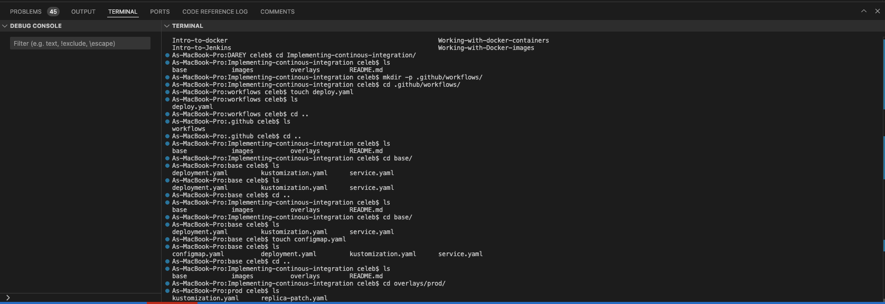
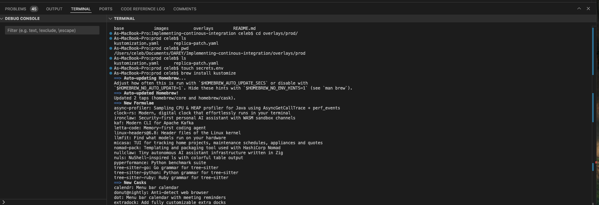
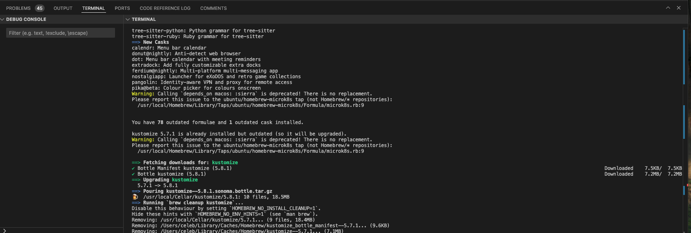
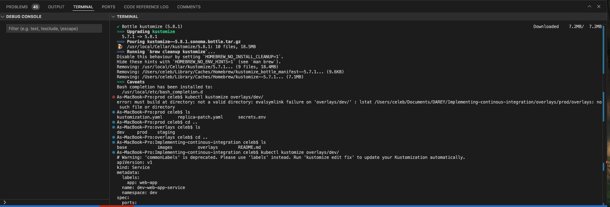
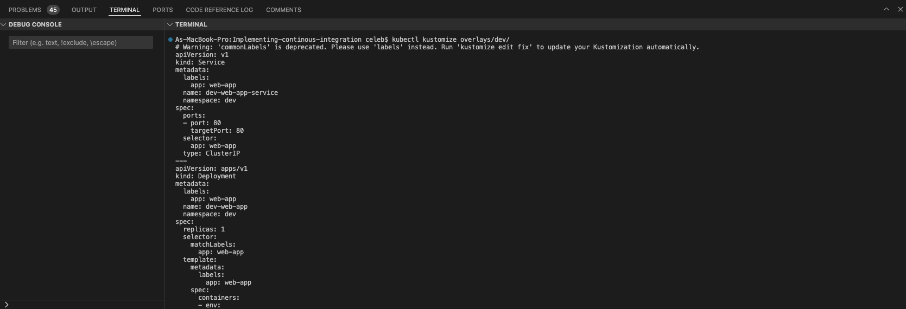

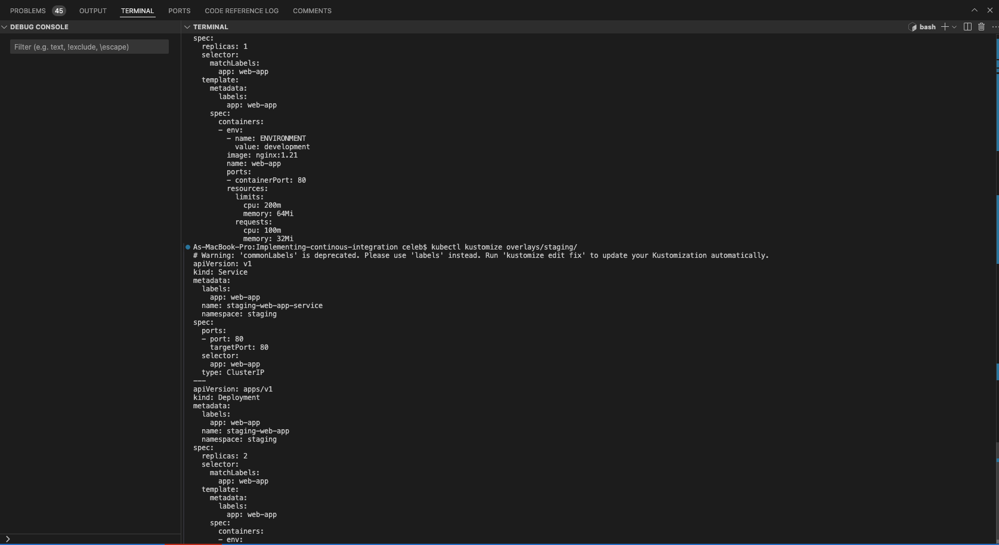
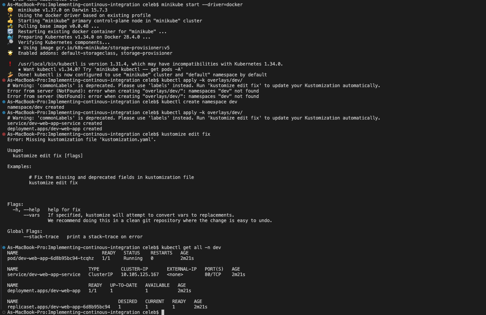
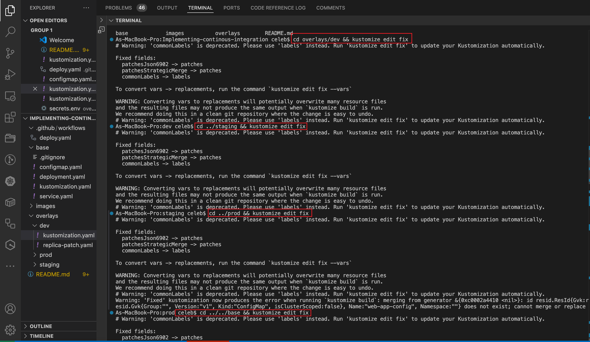
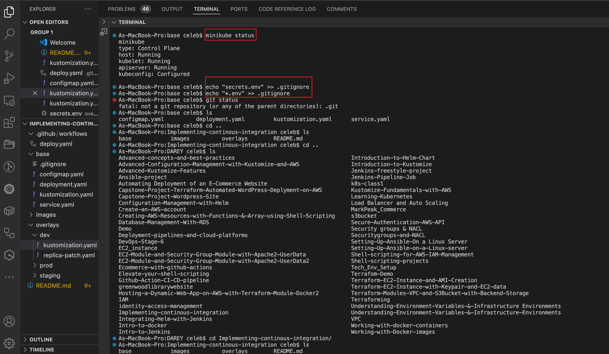
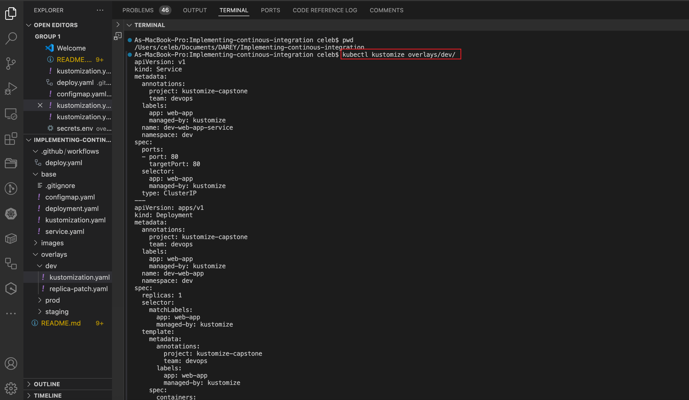
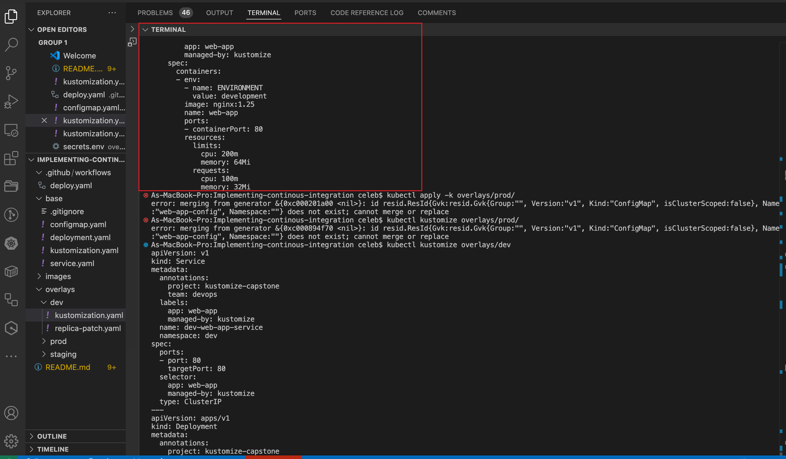
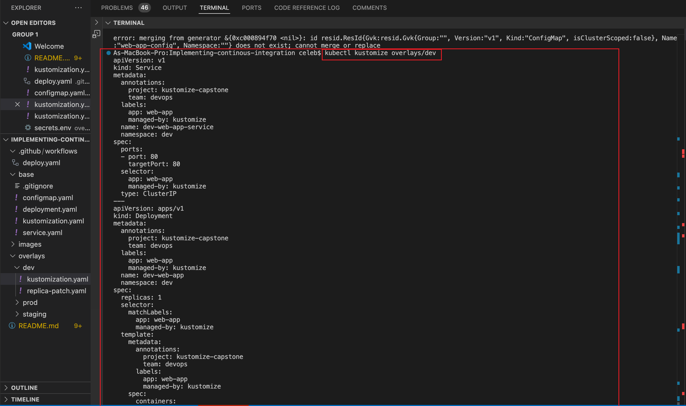
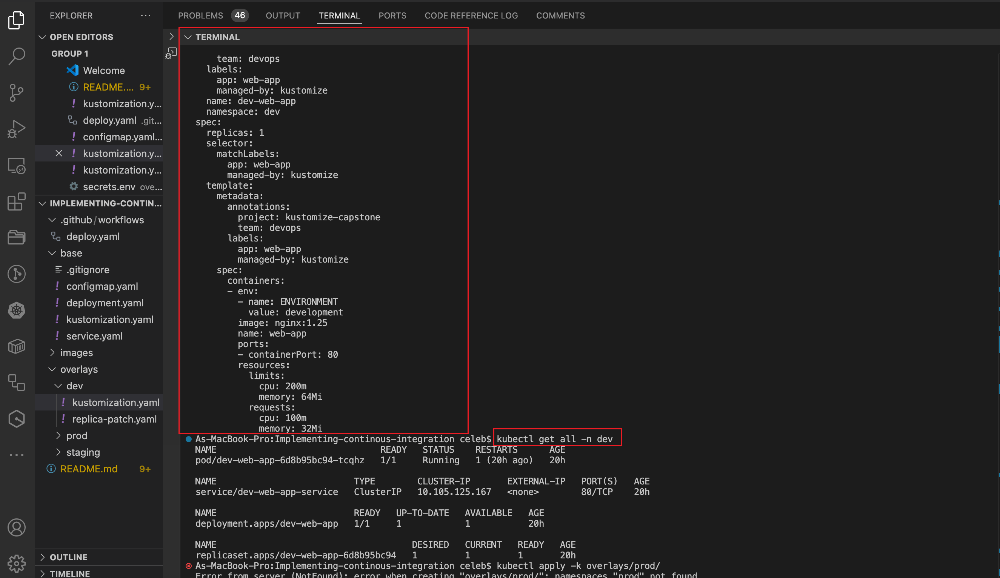
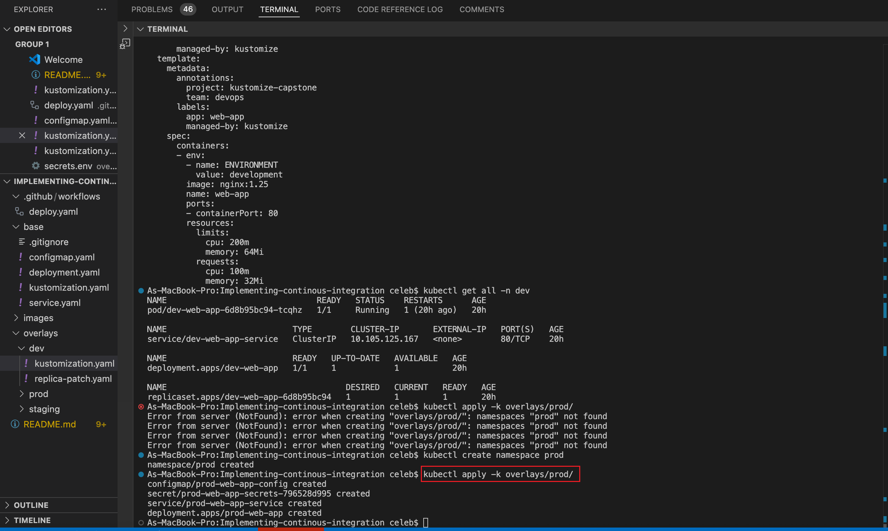
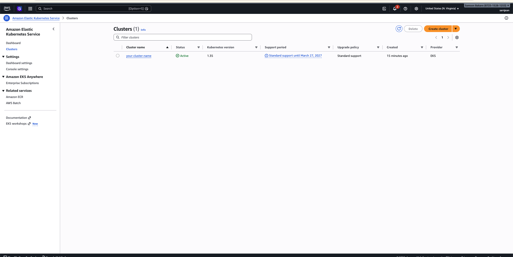
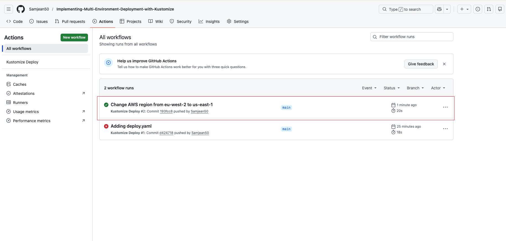

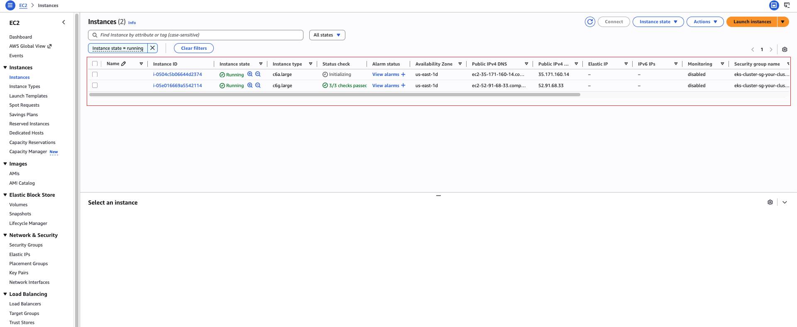
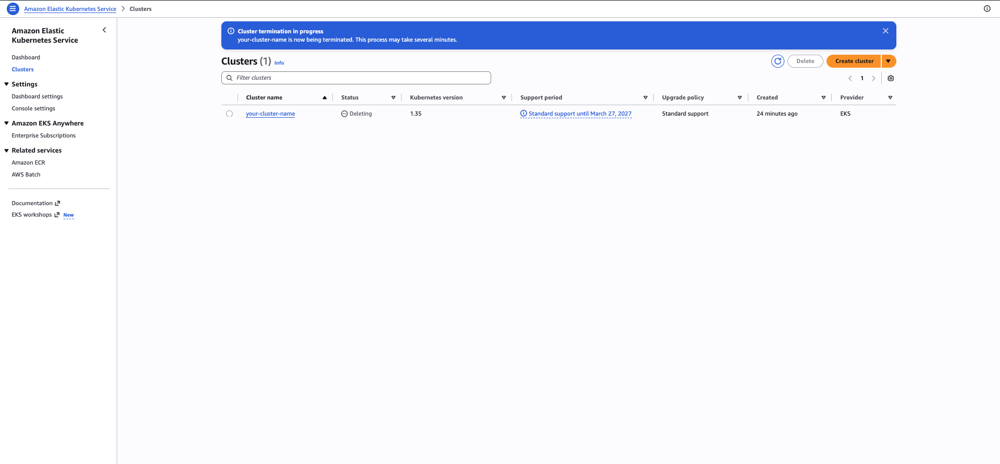
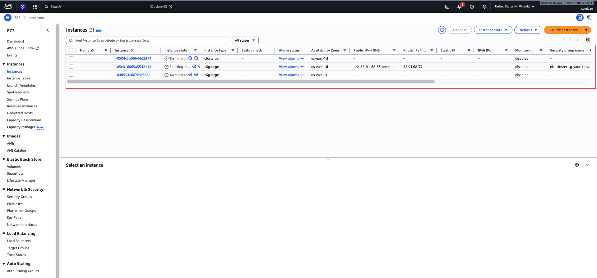
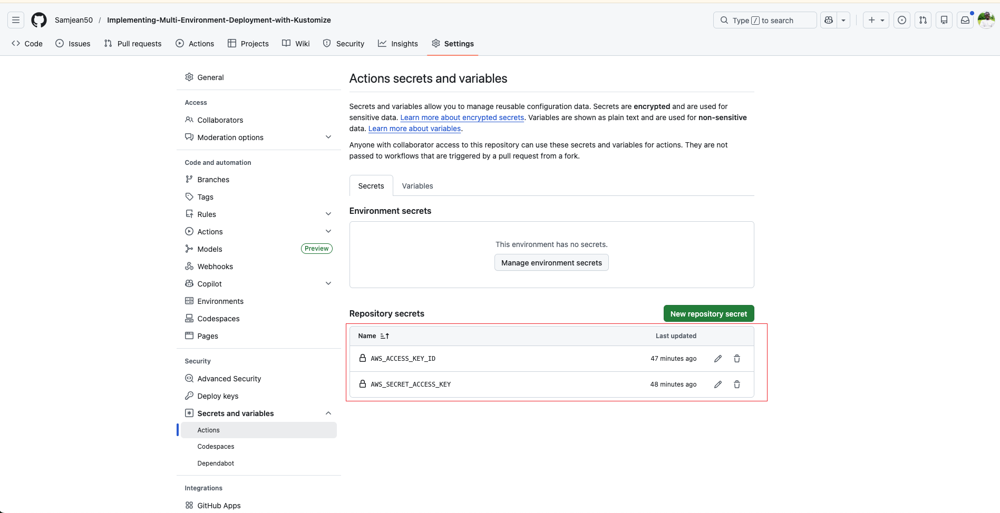

